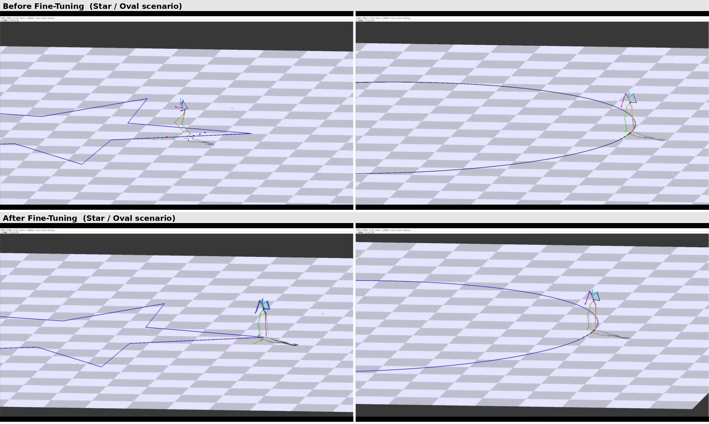

# Motion Matching Locomotion System

C++/OpenGL 기반 실시간 Motion Matching 보행 애니메이션 시스템. Feature vector 설계가 motion 품질에 미치는 영향을 정량적으로 분석한 학부 연구 프로젝트입니다.

**한국컴퓨터그래픽스학회(KCGS) 2023 구두 발표**

<video src="./assets/motion_matching_demo.mp4" controls width="700">
  실시간 Motion Matching 데모 — 사용자 입력 기반 보행 동작 생성
</video>

---

## Overview

Motion Matching은 대규모 모션 데이터베이스에서 현재 캐릭터 상태와 사용자 입력(trajectory)에 가장 잘 맞는 프레임을 실시간으로 검색해 재생하는 애니메이션 기법입니다. State machine이나 blend tree 없이도 자연스러운 전환을 만들 수 있어 최신 게임(예: *The Last of Us Part II*, *Unreal Engine 5 Motion Matching*)에서 널리 쓰이고 있습니다.

다만 실무에서는 **feature vector를 어떻게 설계하느냐에 따라 tracking 품질이 크게 달라지는데도, 이에 대한 정량적 비교는 많지 않다는 문제의식**에서 이 프로젝트를 시작했습니다.

## What this project does

- C++ / OpenGL 기반 motion matching locomotion 시스템을 처음부터 직접 구현 (motion database 검색 포함)
- Trajectory 기반 feature vector를 여러 방식으로 설계하고, **20개 feature configuration**을 정량적으로 비교
- 원형 / 사각형 / 별 모양 등 서로 다른 trajectory 시나리오에서 motion tracking 성능을 측정

## Results

Feature 설계를 튜닝한 결과, mean trajectory error가 아래와 같이 개선되었습니다.

| Metric | Before Tuning | After Tuning | 개선 |
|---|---|---|---|
| Mean trajectory error | 1.45 m | 0.24 m | **약 83% 감소** |

*Star / Oval 두 시나리오 모두에서 튜닝 후 캐릭터가 목표 trajectory를 훨씬 정밀하게 추종하는 것을 볼 수 있습니다.*

## Tech Stack

| Category | Details |
|---|---|
| Language | C++ |
| Graphics | OpenGL |
| UI Framework | MFC |

## Publication

김수라, 박상일. 「보행 동작 생성을 위한 모션 매칭의 효과적인 특징 벡터 설정에 관한 연구」, *Journal of the Korea Computer Graphics Society*, 29(3), 2023. — 한국컴퓨터그래픽스학회 2023 학술대회 구두 발표.

## Related Work

이 프로젝트에서 발견한 "생성 기반이 아니라 검색 기반이라 in-database 상황에 제한된다"는 한계는, 이후 diffusion 기반 motion generation 연구인 [Environment-Aware Locomotion Synthesis](https://github.com/srsw000521/Environment-Aware-AMDM)로 이어졌습니다.

## Author

김수라 — [GitHub](https://github.com/srsw000521)
